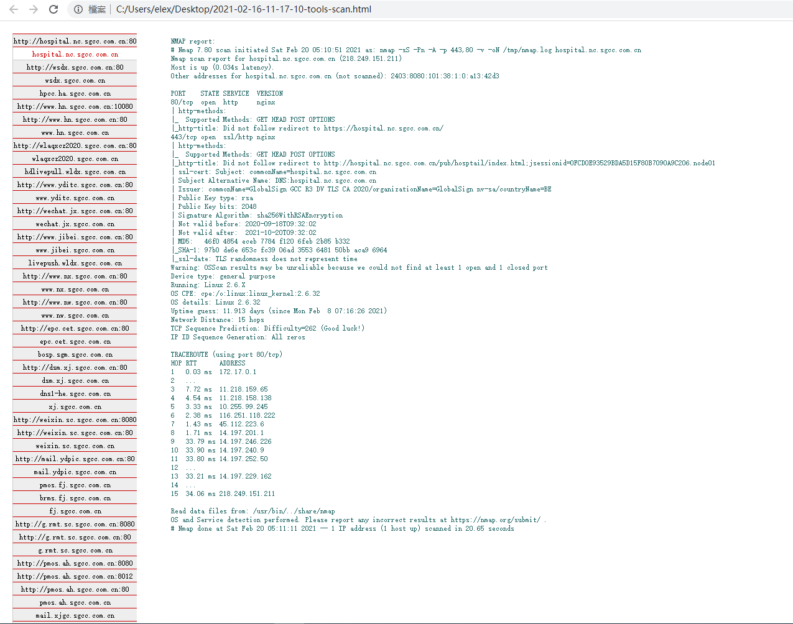
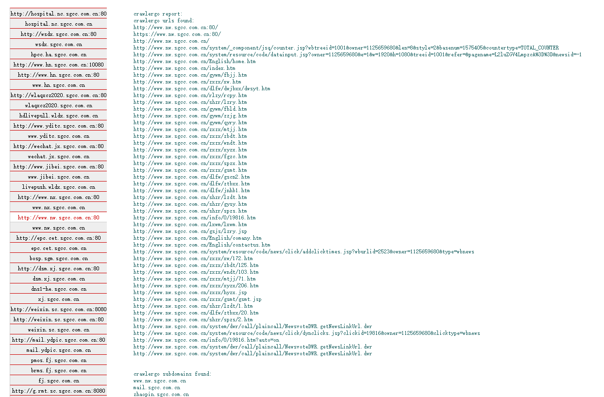
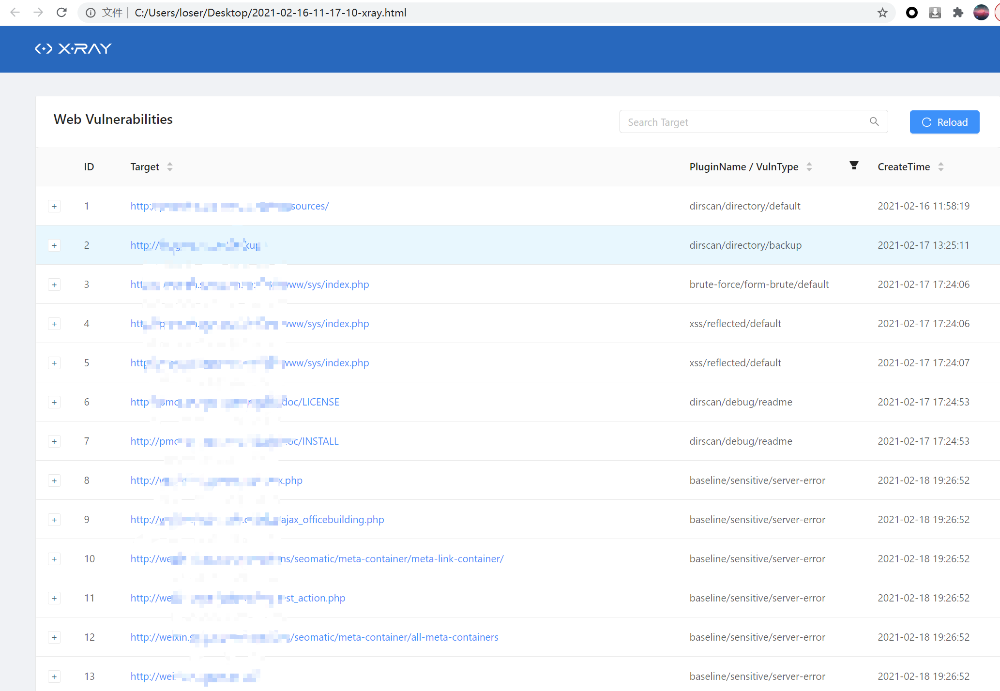

# AutoScanner

## AutoScanner是什么
AutoScanner是一款自动化扫描器，其功能主要是遍历所有子域名、及遍历主机所有端口寻找出所有http服务，并使用集成的工具进行扫描，最后集成扫描报告；  
工具目前有：oneforall、masscan、nmap、crawlergo、dirsearch、xray、awvs、whatweb等  

是之前[hscan](https://www.freebuf.com/sectool/260394.html) 的重构版本；

## AutoScanner做了什么
- 自动下载项目所需要的tools
- 使用oneforall遍历子域名
- 使用masscan遍历主机所有开放端口
- 使用nmap扫描开放端口；得出所有http服务端口
- 使用crawlergo进行扫描
- 动态添加crawlergo扫描到的域名至任务清单
- 使用dirsearch进行目录文件扫描
- 扫描到的目录、文件传递到xray
- 使用xray进行被动扫描
- 扫描结束后生成两份报告，xray和 所有tools集成的一份报告
- ...

另外，在各个工具直接做了很多逻辑处理，如masscan扫描到过多开放端口，直接忽略；如nmap发现80和443同时开放http服务，忽略443；等等  
需要注意的是，项目中提供了awvs的扫描脚本，但是考虑到正版盗版的原因项目中未集成awvs的安装包；

## 项目运行
由于涉及过多pip包依赖及浏览器环境等，建议使用docker运行；  
其中注意项目所需要的工具会自动下载，但是由于国内github网速问题可能会导致下载失败等问题，如果发生，可下载下方包解压到tools目录；  
链接: https://pan.baidu.com/s/1FAP02yYK7CF9mxMD0yj08g  密码: a6p4

## 截图展示
部分截图可以看之前的[hscan](https://www.freebuf.com/sectool/260394.html)；
这儿展示下单独的tools的报告

