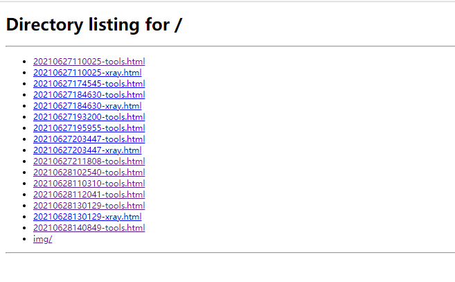
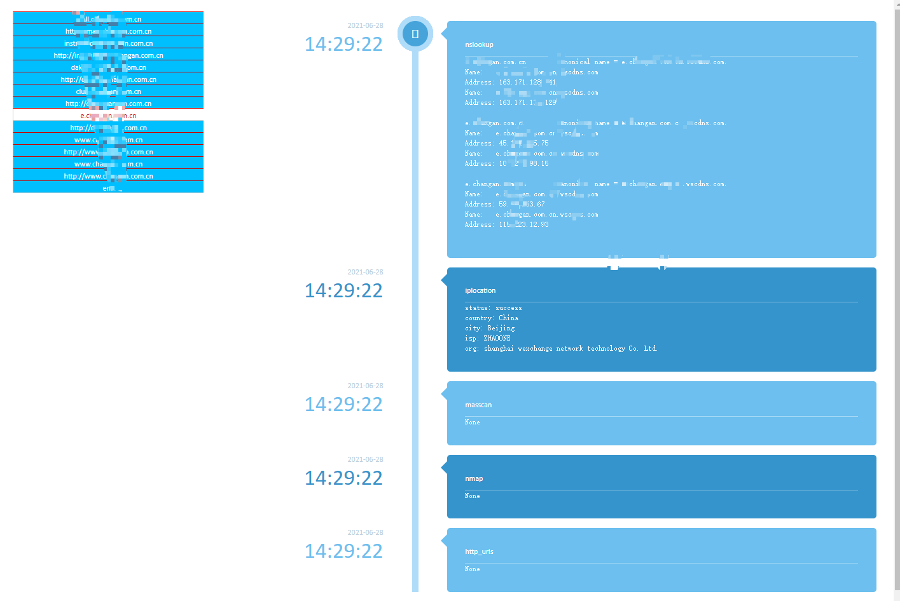
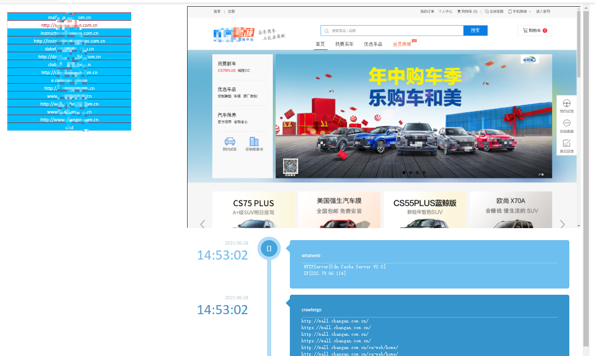

# AutoScanner

## AutoScanner是什么
AutoScanner是一款自动化扫描器，其功能功能分为两块：  
+ 1 遍历所有子域名、子域名主机所有端口及所有http端口服务
+ 2 对子域名主机信息进行相关检测，如cname解析判断是否是cdn、域名定位信息判断是否为云服务器、masscan扫端口、nmap等
+ 3 对http端口服务截图、使用集成的工具如crawlergo、xray、dirsearch等进行扫描；
+ 4 集成扫描报告

AutoScanner对工具之间的调用衔接做了很多处理，及对渗透测试的相关信息收集做了记录；具体信息看报告文件即可，

## 项目运行
由于涉及过多工具、python包依赖及浏览器环境等，建议使用docker运行；  

### 0x01 工具下载
二选一即可
- 工具在执行docker时自动下载, (国内从github下载，可能非常慢)
- 下载百度云,将解压的tools目录放置项目主目录即main.py这一层；
    + 链接: https://pan.baidu.com/s/1FAP02yYK7CF9mxMD0yj08g  密码: a6p4

### 0x02 构建镜像
- `docker build -t auto .`

### 0x03 执行项目
- docker运行命令参数已放入docker_run.sh文件中，直接修改执行`./docker_run.sh`即可  
- 其中支持参数为：
    + -d domain
    + -f 包含domains的文件
    + --fq 从企查查导出的企业备案域名xls文件

### 0x04 报告查看
- 执行`python3 -m http.server 80 --directory report/`, 在浏览器中输入地址即可

## 截图展示

